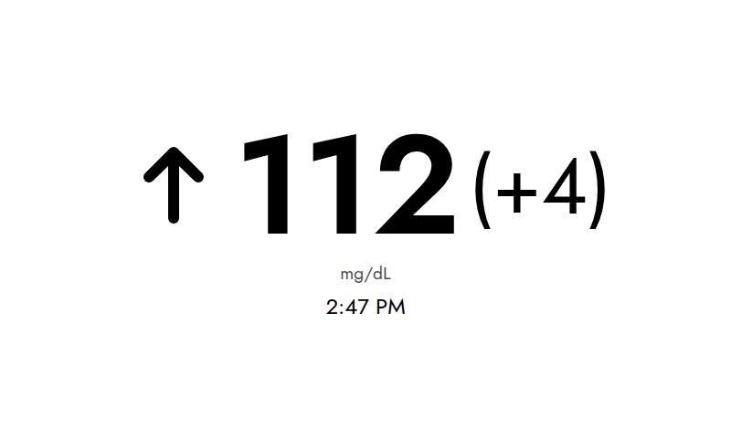

# InkyPi-BloodSugar

*InkyPi-BloodSugar* is a plugin for [InkyPi](https://github.com/fatihak/InkyPi) that displays your live Dexcom blood glucose reading, trend arrow, delta from the previous reading, and time of the last reading on an e-ink display.

> [!WARNING]
> **Not a medical device. Do not use this display to make treatment decisions.**
>
> This is a hobbyist convenience display built on an unofficial, undocumented API. It is not FDA-cleared, not validated, and has no alarms. It can show wrong or outdated data without any indication of a problem — the network can drop, the sensor can fail, the Share upload can stall, the e-ink panel only refreshes on a schedule, and the API can change or break at any time. Always confirm with your CGM app or a fingerstick meter before dosing insulin, treating a low, or taking any other action.

## Screenshot



## Installation

Install the plugin using the InkyPi CLI, providing the plugin ID and this repository's URL:

```bash
inkypi plugin install blood_sugar https://github.com/cartagena/InkyPi-BloodSugar
```

## External API

This plugin depends on Dexcom's **Share API** — the same private, unofficial API the Dexcom Follow mobile apps use to poll a shared CGM account. There is no public developer program or official documentation for it (it's reverse-engineered), and it may change or break without notice. [pydexcom](https://github.com/gagebenne/pydexcom) is a well-known open-source client for this same API and is the closest thing to reference documentation available.

**Why not the official Dexcom API?** Dexcom does publish an [official developer API](https://developer.dexcom.com/), but it's explicitly not real-time: per its [data availability docs](https://developer.dexcom.com/docs/dexcomv3/endpoint-overview#data-availability), readings are delayed by **1 hour in the US and 3 hours outside the US**. That's unusable for a display meant to show your current glucose. The unofficial Share API is what the Dexcom Follow mobile app itself uses, so it reflects readings as soon as they sync — this plugin uses the same approach for the same reason. It's not a novel workaround either: [MMM-SugarValue](https://github.com/balharrie/MMM-SugarValue), a MagicMirror module with the same goal, uses the identical Share API for the identical reason.

- **Requires credentials, not a traditional API key.** You need your Dexcom account's username and password.
- **Requires Share to be enabled** on the Dexcom account, with at least one Follower configured (Settings → Share in the Dexcom G6/G7 app). The plugin authenticates as a follower, not the primary account, so add yourself as a follower if you haven't already.
- **Free**, with no formal request quota or paid tier — it's the same traffic pattern as the Dexcom Follow app checking in on a shared account. There's no cost beyond the active Dexcom CGM subscription you'd already need to be generating readings in the first place. Since it's an unofficial API, keep the refresh interval reasonable (every 5 minutes matches typical CGM update cadence) rather than polling aggressively.

### Setup

On the InkyPi web UI, go to the **API Keys** page and add:

```
DEXCOM_USERNAME=your-dexcom-username
DEXCOM_PASSWORD=your-dexcom-password
```

Then add the plugin to a playlist and choose your server region (US or Outside US), preferred units (mg/dL or mmol/L), and low/high glucose thresholds in the plugin settings.

## Testing

Two suites, split by what they need. **No test in either one ever contacts Dexcom** — the API is mocked everywhere, so running the suite never touches a real CGM account.

### Unit tests — run anywhere

No InkyPi, no network, no browser. From a bare clone:

```bash
pip install -r requirements-dev.txt
pytest tests/unit
```

Covers the Dexcom client (trend normalization, `WT` timestamp parsing, mg/dL↔mmol/L conversion, malformed responses, login and the retry-after-session-expiry flow against a mocked `requests.post`) and the plugin's display logic (delta formatting, threshold coloring, staleness, timezone rendering, client caching).

`tests/conftest.py` stands in for the one host module the plugin imports (`BasePlugin`). Its `render_image` deliberately raises rather than returning a fake image, so a template regression can't pass here — that's the integration suite's job.

### Integration tests — need a real InkyPi checkout

Runs against the real `BasePlugin`, the real plugin registry, and the real Jinja + headless-Chromium render pipeline — including all seven trend-arrow SVGs, which are ``d and so only fail at render time.

```bash
git clone https://github.com/jtn0123/InkyPi ../InkyPi
ln -s "$PWD/blood_sugar" ../InkyPi/src/plugins/blood_sugar
INKYPI_PATH=../InkyPi pytest tests/integration
```

Without `INKYPI_PATH` these are skipped, not failed, so a plain `pytest` from a clean clone still exits green having run the unit suite.

CI runs both, plus the *unit* suite a second time with `INKYPI_PATH` set — the same tests unstubbed, so a stub that has drifted from InkyPi's real behavior surfaces as a failure instead of quietly still passing.

## Development status

Actively maintained.

## License

This project is licensed under the MIT License - see the [LICENSE](LICENSE) file for details.
